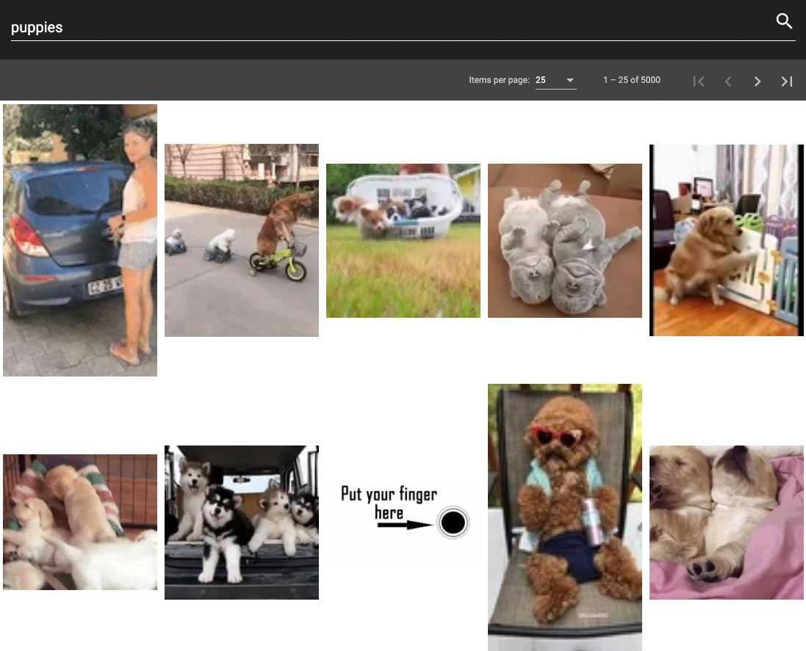
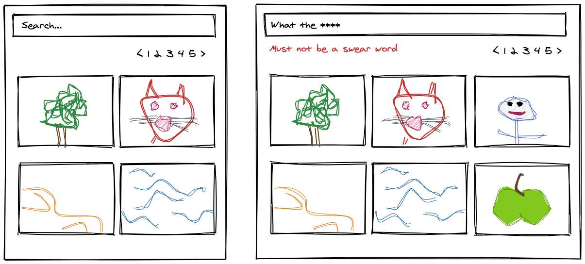

# Fedex Test - Adam Hammad

This project was generated with [Angular CLI](https://github.com/angular/angular-cli) version 9.1.7.

# Table of Contents

1. [Development](#Development)
2. [Testing](#Testing)
3. [UX](#UX)
4. [Technical Considerations](#Technical-Considerations)
   - [GIPHY API](#GIPHY-API)
   - [State Managament](#State-Managament)
   - [Third Party Libraries](#Third-Party-Libraries)

# Development

### Setup

Clone the repository `git clone https://github.com/botoxparty/fedex-test`

Install the NPM dependencies `npm install`

### Dev

Run `ng serve` for a dev server. Navigate to `http://localhost:4200/`. The app will automatically reload if you change any of the source files.

### Build

Run `ng build` to build the project. The build artifacts will be stored in the `dist/` directory. Use the `--prod` flag for a production build.

## Testing

I have included both unit and e2e tests.

### Running unit tests

Run `ng test` to execute the unit tests via [Karma](https://karma-runner.github.io).

### Running end-to-end tests

Run `ng e2e` to execute the end-to-end tests via [Protractor](http://www.protractortest.org/).

# UX

The interface is made up of 3 components: Search, Pagination, Grid

I have chosen to use the [Angular Material](https://material.angular.io/) component library.
The grid is responsive for mobile, tablet and desktop devices.

Components used:

- [MatInput](https://material.angular.io/components/input/overview)
- [MatFormField](https://material.angular.io/components/form-field/overview)
- [MatToolbar](https://material.angular.io/components/toolbar/overview)
- [MatPaginator](https://material.angular.io/components/paginator/overview)
- [MatIcon](https://material.angular.io/components/icon/overview)

## Wireframe

## Potential Improvements

#### Infinite scroll & Virtual scroll

You could implement infinite scroll with the pagination, but it would also need to be a virtual scroll.

Otherwise if you scroll down a few pages you can have hundreds of elements loaded in your DOM which will eventually cause the browser to crash.

#### Skeleton loaders

To reduce friction when searching and navigating between pages skeleton loaders could be added. This will benefit the perceived speed of the application.

# Technical Considerations

## GIPHY API

- The GIPHY API cannot paginate beyond 5,000 items.
- The GIPHY API does not always return a preview URL

## State Managament

I am using the URL query parameters to manage the application state. It makes search results easy for users to save and share.

Try it out: [http://localhost:4200/?q=puppies&page=20&size=50](http://localhost:4200/?q=puppies&page=20&size=50)

## Third Party Libraries

### [simple-profanity-filter](https://badge.fury.io/js/simple-profanity-filter)

A really simple library that uses RegEx to parse bad words from a string.

- No dependencies
- Uses Google's swear word list (was previously an API but is now closed)
- Tests included
- Lightweight and expandable

### [@giphy/js-fetch-api](https://github.com/Giphy/giphy-js/blob/master/packages/fetch-api/README.md)

When using the official library there were incompatibilies using switchMap to cancel previous requests (e.g. if the user clicks through pages very fast). switchMap requires an Observable and the official SDK returns a Promise from fetch. Converting the Promise to an Observable was not working.

I implemented my own service and included `@giphy/js-fetch-api` as a devDependency because i'm only using the typings from the library. As a benefit there's a reduction in package size and dependencies, however it has increased the complexity for maintenance. You can verify the correct behaviour for cancelling previous requests in the network inspector.

_Preview of my implementation working correctly with switchMap to cancel previous requests_

Looking further down the line, if I needed to use more of the API's features it could be worth switching to the official library as this will have an impact on maintainability. The official library comes fully tested and it would be good to leverage that. I would probably fork the official library and have an input for a custom HTTP client to perform the request, that way I could override the fetch request that currently gets called and return an Observable.

### [@angular/material](https://material.angular.io/)

See components used in [UX](#UX)
